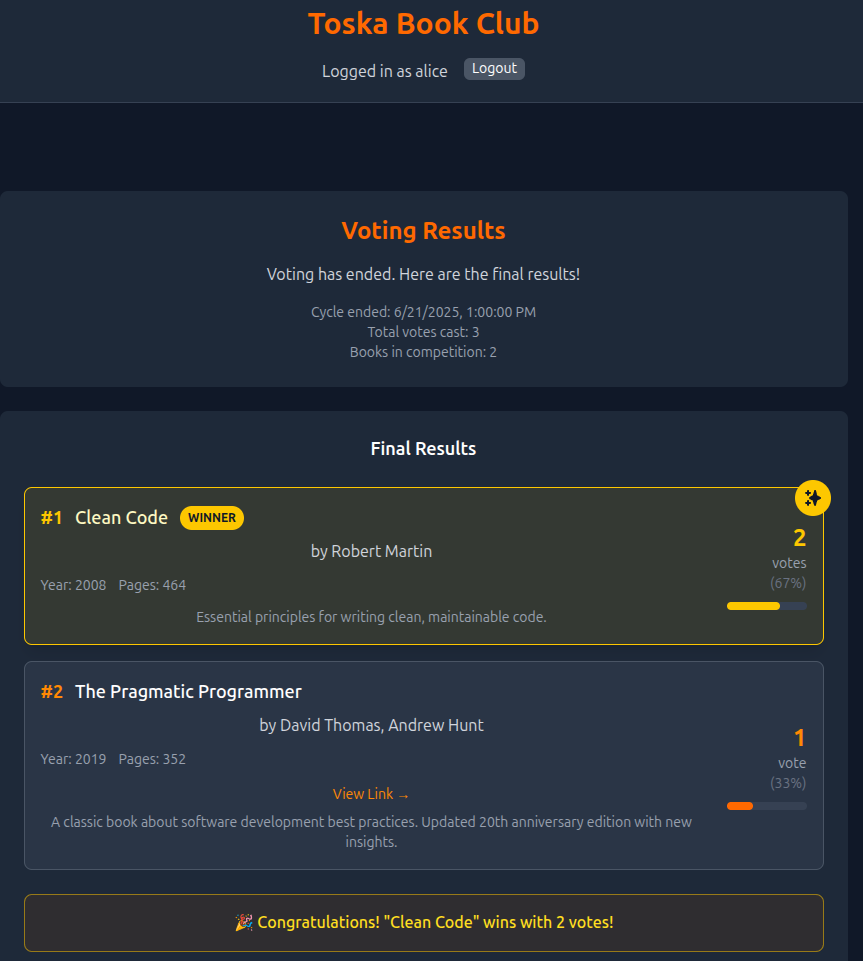

# 📚 Toska Book Club

A _vibe-coded_ book club app for small book clubs.

The app has three phases of a **voting cycle**:

- Suggestions: All users can submit one book suggestion
- Voting: All members give votes
- Results: Results are shown.

The cycles are automatically changed based on deadlines for each phase set by admin.
When results are shown, a voting cycle is completed. Admin can then start a new one. While a cycle is ongoing, admin can edit the deadlines.
When a user first enters the page, they need to either login, or register. Registering requires a secret value, so only book club members can join.

**Built using:** React, Typescript, TailwindCSS, Tanstack-Query, Kysely, PostgreSQL, Eslint, Docker, Vite.

Vibe-coded with Claude Code.

---

## 🚀 Features

- 🧾 **Book suggestions**: One per user, with title & author required.
- 🗳️ **Voting**: Vote for any number of suggestions before the deadline.
- 🏆 **Results**: Sorted by votes, anonymously.
- 🔐 **Auth**: JWT-based login (12h expiry), roles: `admin` / `user`.
- 🛠️ **Admin powers**: Start a new round by setting suggestion & voting deadlines.

See full list: [docs/feats.md](docs/feats.md)

## 🧰 Commands

### 🔄 Development

- `npm run dev` – Start backend & frontend (with Docker)
- `npm run install:backend` – Install backend deps inside Docker
- `npm run install:frontend` – Install frontend deps inside Docker

### 🗃️ Database

- `npm run migrate:up` – Run latest DB migrations
- `npm run migrate:down` – Revert last DB migration
- `npm run init-test-data` – Load test data into DB
- `npm run pgcli` – Open Postgres CLI (requires [pgcli](https://github.com/dbcli/pgcli) to be installed). `password` is the password

### ✅ Tests

- `npm test` – Run tests in watch mode
- `npm run test:run` – Run all tests once
- `npm run test:api` – Run backend tests

### Tips

- See [test data description](docs/test-users.md)
- Test the three phases by logging in with admin-user (`admin - admin123`) and adjusting the deadlines
- After re-initializing test data, logout and re-login because your user doesn't exist anymore

---

## 💡 Future Ideas

- 🔢 Rank-based voting
- ⭐ Book feedback/rating phase
- 🧑‍🤝‍🧑 Multi-club support with roles:

  - 🧙 Superadmin (manage all clubs)
  - 👩‍💼 Club manager (admin of one club)

---

Contribute with issues or PRs – we welcome ideas! ✨
