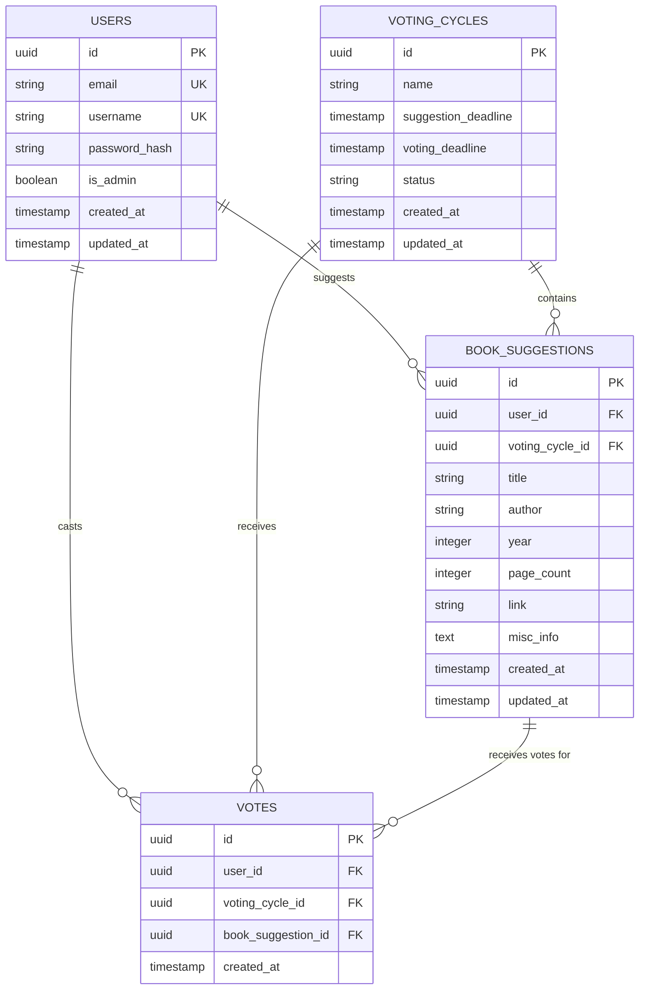

# Database Schema for Toska Book Club

## Overview

The database schema is designed to support a simple book club voting application. The core functionality revolves around cyclic voting phases where users suggest books, vote on suggestions, and view results. The schema is intentionally minimal to support the core features: user authentication, book suggestions, voting cycles, and vote tracking.

The system operates in three phases: suggestion (users propose books), voting (users select preferred books), and results (vote tallies are displayed). An admin user controls the transition between phases by setting deadlines.

## Entity Relationship Diagram

## Table Definitions

### users

User accounts with authentication and role management.

**Columns:**
- `id` (UUID, PRIMARY KEY) - Unique identifier for each user
- `email` (VARCHAR(255), UNIQUE, NOT NULL) - User's email address for login
- `username` (VARCHAR(50), UNIQUE, NOT NULL) - Display name, must be unique
- `password_hash` (VARCHAR(255), NOT NULL) - Hashed password for authentication
- `is_admin` (BOOLEAN, DEFAULT FALSE) - Administrative privileges for managing voting cycles
- `created_at` (TIMESTAMP, DEFAULT NOW()) - Account creation timestamp
- `updated_at` (TIMESTAMP, DEFAULT NOW()) - Last account update timestamp

**Constraints:**
- Email must be valid format and unique
- Username must be 3-50 characters and unique
- Password hash must be present

### voting_cycles

Represents each complete cycle of book suggestion, voting, and results.

**Columns:**
- `id` (UUID, PRIMARY KEY) - Unique identifier for each voting cycle
- `name` (VARCHAR(200), NOT NULL) - Descriptive name for the cycle (e.g., "Spring 2024 Selection")
- `suggestion_deadline` (TIMESTAMP, NOT NULL) - When suggestion phase ends
- `voting_deadline` (TIMESTAMP, NOT NULL) - When voting phase ends
- `status` (VARCHAR(20), DEFAULT 'suggesting') - Current phase of the cycle
- `created_at` (TIMESTAMP, DEFAULT NOW()) - Cycle creation timestamp
- `updated_at` (TIMESTAMP, DEFAULT NOW()) - Last cycle update

**Constraints:**
- Voting deadline must be after suggestion deadline
- Status must be one of: 'suggesting', 'voting', 'completed'
- Name must be unique

### book_suggestions

Books suggested by users during the suggestion phase.

**Columns:**
- `id` (UUID, PRIMARY KEY) - Unique identifier for each suggestion
- `user_id` (UUID, FOREIGN KEY to users.id, NOT NULL) - User who made the suggestion
- `voting_cycle_id` (UUID, FOREIGN KEY to voting_cycles.id, NOT NULL) - Which cycle this suggestion belongs to
- `title` (VARCHAR(500), NOT NULL) - Book title (required)
- `author` (VARCHAR(200), NOT NULL) - Book author (required)
- `year` (INTEGER) - Publication year (optional)
- `page_count` (INTEGER) - Number of pages (optional)
- `link` (VARCHAR(1000)) - URL to book information (optional)
- `misc_info` (TEXT) - Additional information about the book (optional)
- `created_at` (TIMESTAMP, DEFAULT NOW()) - When suggestion was made
- `updated_at` (TIMESTAMP, DEFAULT NOW()) - Last suggestion update

**Constraints:**
- Unique constraint on (user_id, voting_cycle_id) - one suggestion per user per cycle
- Title and author are required
- Year must be reasonable if provided (e.g., > 1000 and <= current year + 5)
- Page count must be positive if provided
- Link must be valid URL format if provided

### votes

Individual votes cast by users for book suggestions.

**Columns:**
- `id` (UUID, PRIMARY KEY) - Unique identifier for each vote
- `user_id` (UUID, FOREIGN KEY to users.id, NOT NULL) - User casting the vote
- `voting_cycle_id` (UUID, FOREIGN KEY to voting_cycles.id, NOT NULL) - Which cycle this vote belongs to
- `book_suggestion_id` (UUID, FOREIGN KEY to book_suggestions.id, NOT NULL) - Which book is being voted for
- `created_at` (TIMESTAMP, DEFAULT NOW()) - When vote was cast

**Constraints:**
- Unique constraint on (user_id, voting_cycle_id, book_suggestion_id) - prevents duplicate votes
- Foreign key constraint ensures book_suggestion belongs to the same voting_cycle
- Users can vote for multiple books in the same cycle
- Users cannot vote for their own suggestions (enforced at application level)

## Additional Considerations

### Indexes
- Index on `voting_cycles.status` for efficient phase queries
- Index on `book_suggestions.voting_cycle_id` for listing suggestions
- Index on `votes.voting_cycle_id` for vote counting
- Index on `users.email` for login queries

### Data Integrity
- Cascade deletes: If a voting cycle is deleted, all related suggestions and votes are deleted
- Restrict deletes: Users cannot be deleted if they have suggestions or votes
- Check constraints ensure deadlines are logical and status transitions are valid

### Future Extensions
The schema is designed to be easily extensible for future features like:
- Multiple book clubs (add `book_club_id` to relevant tables)
- Ranked voting (modify votes table to include ranking)
- Book rating/feedback (add rating tables linked to completed cycles)